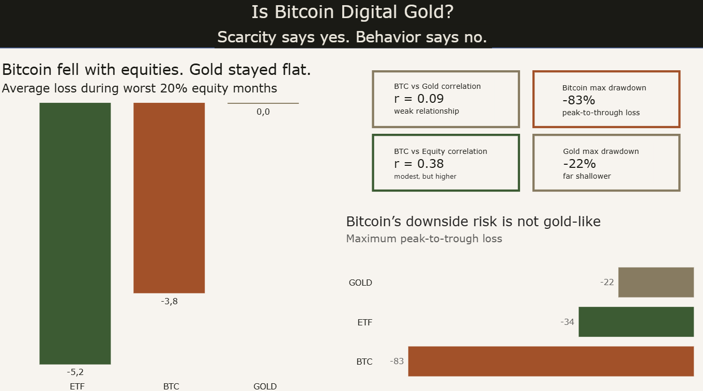
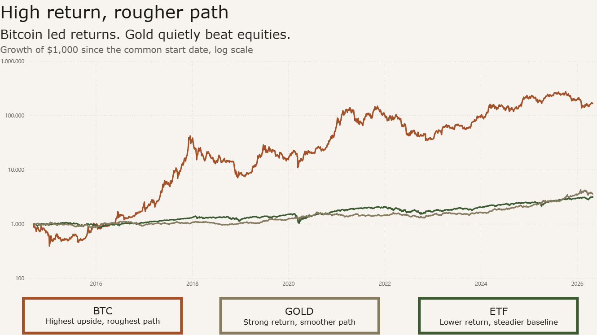
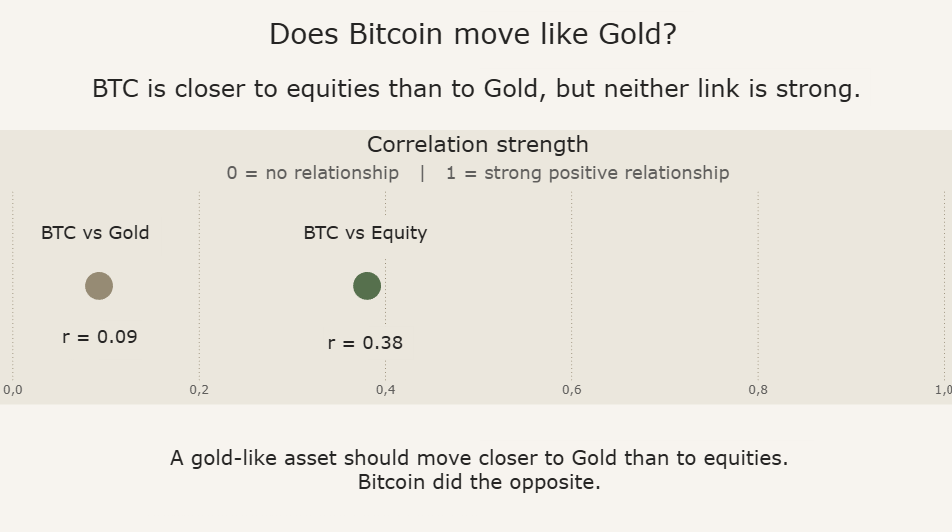
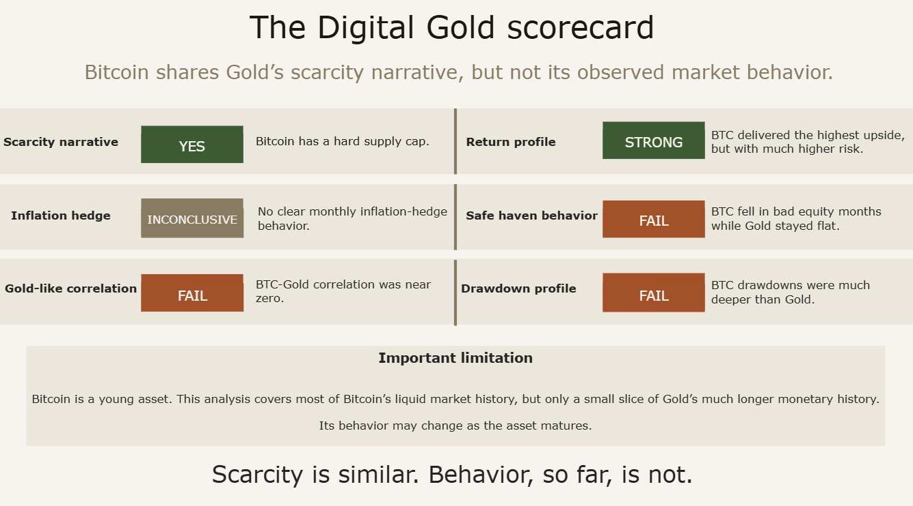

# Bitcoin Digital Gold Analysis

## Project Snapshot

- **Type:** end-to-end data analysis project
- **Tools:** Python, pandas, SciPy, Power BI
- **Data:** Yahoo Finance, FRED
- **Assets:** Bitcoin, Gold, Global Equities
- **Focus:** correlation, safe-haven behavior, real returns, volatility, drawdowns
- **Output:** reproducible Python pipeline, Power BI dashboard, static dashboard screenshots

Is Bitcoin really digital Gold?

> A data analysis project testing whether Bitcoin behaves like Gold in market data, or whether the “digital gold” label is mainly a scarcity narrative.

Bitcoin is often described as “digital Gold”.
The idea sounds intuitive: both are scarce, independent of governments, and viewed by some as alternatives to traditional money.
But scarcity alone does not guarantee similar behavior.

This project tests the Digital Gold claim empirically using BTC, Gold, and global equities from 2014 to 2026.

## 📸 Dashboard Preview

The final Power BI dashboard tells the story across four pages.

### 1. Verdict


### 2. Return path


### 3. Correlation behavior


### 4. Final scorecard


The interactive Power BI file is available as:

```text
btc-digital-gold-dashboard.pbix
````

## 🎯 Research Question

Bitcoin is often called “digital Gold” because of its fixed supply.

This project asks:

> Does Bitcoin only resemble Gold in its scarcity narrative, or has it also behaved like Gold in market data?

To test this, the analysis compares Bitcoin with:

| Asset           | Ticker  | Role                             |
| --------------- | ------- | -------------------------------- |
| Bitcoin         | BTC-USD | Digital Gold candidate           |
| Gold            | GLD     | Traditional safe-haven benchmark |
| Global equities | ACWI    | Risk-asset benchmark             |

## 🧠 Background

Gold has historically been viewed as a store of value and partial safe haven.
Bitcoin is sometimes described as a digital version of Gold because its supply is algorithmically limited.

However, an asset can be scarce without behaving like a safe haven.

This project therefore separates the narrative from the observed behavior:

* Does Bitcoin move like Gold?
* Does Bitcoin hold up when equities fall?
* Does Bitcoin hedge inflation?
* Did Bitcoin deliver higher returns, and at what risk?
* Has Bitcoin behaved like digital Gold so far?

## 📊 Data Sources

| Source                       | Data                        | Series / Tickers   |
| ---------------------------- | --------------------------- | ------------------ |
| Yahoo Finance via `yfinance` | Daily adjusted close prices | BTC-USD, GLD, ACWI |
| FRED via `fredapi`           | US CPI inflation            | CPIAUCSL           |
| FRED via `fredapi`           | Fed Funds Rate              | FEDFUNDS           |

## 📆 Analysis Period

The analysis uses the longest common period available for BTC, Gold, and global equities:

```text
2014-09-17 to 2026-04-30
```

Only days where all three assets have valid prices are used.
No forward-fill is applied across asset calendars.

## ⚙️ Methodology

The project uses a reproducible Python pipeline:

1. Download daily prices for BTC, Gold, and global equities
2. Inner-join assets on common trading days
3. Calculate monthly returns
4. Add macro data from FRED
5. Run Digital Gold tests:

   * Spearman correlation
   * safe-haven behavior in bad equity months
   * inflation sensitivity
   * rate sensitivity
   * real returns
   * volatility
   * maximum drawdown
6. Export clean CSV files for Power BI

### Why Spearman correlation?

Spearman correlation is used instead of Pearson correlation because Bitcoin returns are highly non-normal and fat-tailed.

Spearman measures whether two assets tend to move in the same rank order, without assuming a linear relationship or normally distributed returns.

### Safe-haven test

Bad equity months are defined as the worst 20% of monthly global equity returns.

The test asks:

> When equities perform poorly, does Bitcoin behave more like Gold or more like a risk asset?

## 📈 Key Results

### 1. Bitcoin did not behave like a safe haven

During the worst 20% of equity months:

| Asset           | Average return |
| --------------- | -------------: |
| Gold            |         +0.02% |
| Bitcoin         |         -3.77% |
| Global equities |         -5.18% |

Gold stayed essentially flat.
Bitcoin fell with equities.

This is one of the clearest findings challenging the Digital Gold safe-haven claim.

### 2. BTC-Gold correlation was near zero

Full-period Spearman correlation of monthly returns:

| Pair                    | Spearman r | Interpretation     |
| ----------------------- | ---------: | ------------------ |
| BTC vs Gold             |       0.09 | Near zero          |
| BTC vs Global equities  |       0.38 | Modest, but higher |
| Gold vs Global equities |       0.25 | Weak/modest        |

Bitcoin was closer to equities than to Gold, but neither relationship was strong.

This matters:
The result does **not** show that Bitcoin is simply an equity clone.
It shows that Bitcoin has not moved like Gold.

### 3. Bitcoin delivered extraordinary returns

Real CAGR, inflation-adjusted:

| Asset           | Real CAGR |
| --------------- | --------: |
| Bitcoin         |    53.30% |
| Gold            |     8.62% |
| Global equities |     7.46% |

Bitcoin dominated total returns.

Gold also performed strongly and quietly outperformed global equities over the period.

### 4. Bitcoin’s path was much rougher

Maximum drawdown:

| Asset           | Max drawdown |
| --------------- | -----------: |
| Bitcoin         |      -83.04% |
| Global equities |      -33.53% |
| Gold            |      -22.00% |

Bitcoin delivered the highest upside, but its downside risk was not Gold-like.

### 5. Bitcoin remained much more volatile

Annualized volatility:

| Asset           | Annualized volatility |
| --------------- | --------------------: |
| Bitcoin         |                66.41% |
| Global equities |                16.93% |
| Gold            |                15.94% |

Bitcoin remained roughly four times as volatile as Gold and global equities.

### 6. Inflation hedge behavior was inconclusive

None of the assets showed clear monthly inflation-hedge behavior.

This does not mean the assets failed to beat inflation over the full period.
It means they did not reliably rise in the same months when inflation was high.

## 🧾 Final Interpretation

Bitcoin shares Gold’s scarcity narrative, but not its observed market behavior.

The strongest case for Bitcoin is:

* fixed supply
* high long-term return
* independent monetary narrative

The weaker case is:

* safe-haven behavior
* Gold-like correlation
* Gold-like drawdown profile

Final takeaway:

> Scarcity is similar. Behavior, so far, is not.

## ⚠️ Limitations

Bitcoin is a young asset.

This analysis covers most of Bitcoin’s liquid market history, but only a small slice of Gold’s much longer monetary history.

Future behavior may change as Bitcoin matures, adoption broadens, and market structure evolves.

Additional limitations:

* GLD is used as a tradable Gold proxy, not physical Gold
* ACWI is used as a global equity benchmark
* Correlation does not imply causation
* Safe-haven behavior is tested using the worst 20% of equity months, which is an intuitive but not universal stress definition
* Macro relationships such as inflation sensitivity are descriptive, not causal
* Static screenshots cannot fully replicate the interactive Power BI dashboard

## 🛠️ Tools

* Python
* pandas
* SciPy
* yfinance
* fredapi
* Power BI
* Git / GitHub

## ⚙️ Reproducing the Analysis

Install dependencies:

```bash
pip install pandas yfinance fredapi scipy python-dotenv
```

Create a `.env` file with your FRED API key:

```text
FRED_API_KEY=your_key_here
```

Then run:

```bash
py src/prepare_data.py
py src/q1_correlation.py
py src/q2_real_returns.py
py src/q3_digital_gold.py
py src/q4_volatility.py
py src/q5_drawdown.py
py src/export_for_bi.py
```

The Power BI-ready CSVs are written to:

```text
data/processed/bi/
```

## 🤖 Use of AI

AI tools were used to support project structuring, wording, debugging, and code refinement.